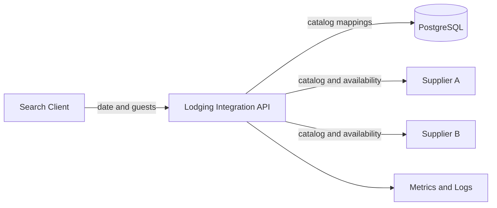
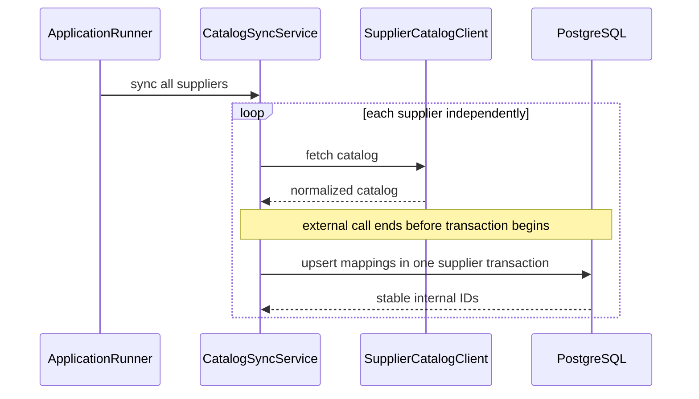
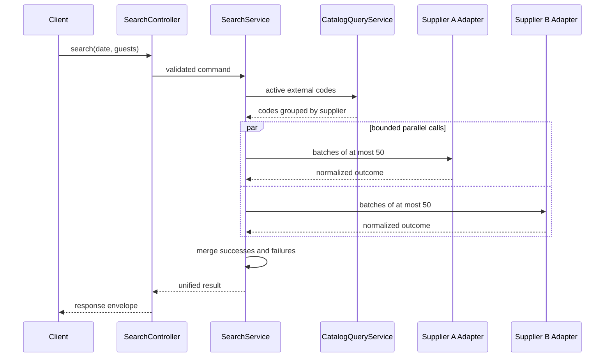

# Architecture

상태: Proposed - Gate 2 review

2026-09-04 승인 범위: 소프트 삭제와 catalog 부분 준비는 [POL-001/002](policy-decisions.md)로 확정되었습니다. 전부 정규화 실패 시 검색 응답은 [POL-003](search-response-policy.md) 검토 중이며 전체 설계와 구현 시작은 승인 대기입니다.

## 설계 목표

시스템은 서로 다른 Supplier 계약을 내부 표준으로 변환하고 하나의 검색 API로 제공합니다. 다음 품질 속성을 우선합니다.

1. 식별자 안정성: 같은 외부 상품은 반복 동기화 후에도 같은 내부 ID를 사용합니다.
2. 장애 격리: 한 Supplier 또는 한 배치의 실패가 다른 결과를 막지 않습니다.
3. 경계 명확성: 외부 DTO와 실패 규칙이 내부 도메인으로 유출되지 않습니다.
4. 검증 가능성: 정상, 오류, 지연, 무응답을 로컬과 테스트에서 재현합니다.
5. 확장성: 신규 Supplier 추가가 기존 검색 orchestration의 수정을 요구하지 않습니다.

## 시스템 컨텍스트



실제 외부 시스템 대신 로컬에서는 별도 포트의 WireMock이 두 Supplier 역할을 수행합니다.

## 애플리케이션 구조

단일 Spring Boot 애플리케이션을 도메인 단위로 나눕니다. 완전한 헥사고날 구조를 모든 클래스에 강제하지 않고, 외부 연동과 영속성처럼 교체 가능성이 높은 경계에 명시적인 port를 둡니다.

```text
io.github.samuel426.lodginghub
├── catalog
│   ├── entity
│   ├── repository
│   ├── service
│   └── dto
├── search
│   ├── controller
│   ├── dto
│   ├── model
│   └── service
├── supplier
│   ├── client
│   ├── model
│   ├── a
│   │   ├── client
│   │   ├── dto
│   │   └── mapper
│   └── b
│       ├── client
│       ├── dto
│       └── mapper
└── global
    ├── config
    ├── error
    ├── response
    └── trace
```

### 책임

| 영역 | 책임 | 의존하면 안 되는 것 |
|---|---|---|
| `catalog` | 내부 숙소/객실과 외부 코드 매핑, 동기화 | 검색 HTTP 응답 DTO |
| `search` | 요청 검증, 대상 코드 조회, 병렬 호출, 결과 병합 | Supplier별 외부 DTO |
| `supplier` | 외부 HTTP 계약, 인증 헤더, 실패 판정, 정규화 | JPA Entity, Controller DTO |
| `global` | 설정, 공통 응답, 예외, trace | 도메인 비즈니스 규칙 |

`search`는 `catalog` Entity를 직접 사용하지 않고 조회용 projection을 받습니다. Supplier client도 외부 응답 DTO 대신 내부 `SupplierOffer` 또는 실패 결과를 반환합니다.

## 카탈로그 동기화 흐름



### 동기화 정책

- 애플리케이션 시작 시 Supplier별로 독립 실행합니다.
- 원격 호출 중에는 DB 트랜잭션을 열지 않습니다.
- 정상 응답을 검증한 다음 Supplier 하나의 변경을 짧은 트랜잭션으로 반영합니다.
- 기존 외부 키는 내부 ID를 유지하고 이름과 수용 인원 같은 정적 속성만 갱신합니다.
- 성공한 전체 목록에서 사라진 매핑은 삭제하지 않고 비활성화합니다.
- 성공한 반영과 같은 트랜잭션에서 Supplier별 마지막 성공 시각을 갱신합니다. 빈 목록도 정상적으로 반영된 성공입니다.
- 동기화 실패 시 기존 매핑과 마지막 성공 시각을 변경하지 않고, 시도 시각과 실패 분류만 기록합니다.
- 모든 Supplier가 첫 동기화에 실패해 성공 이력이 하나도 없으면 검색 API는 `CATALOG_NOT_READY`를 반환합니다.
- 일부 Supplier만 성공 이력이 있으면 검색을 계속하고, 미준비 Supplier는 `meta.unavailableCatalogSuppliers`로 알립니다.
- 주기 동기화는 확장 설계로 남기고 첫 구현에서는 시작 시 동기화만 수행합니다.

## 통합 검색 흐름



### 병렬성 모델

- Controller는 Spring MVC를 사용합니다.
- Supplier client는 `Mono<SupplierBatchOutcome>`을 반환합니다.
- 검색 서비스는 Supplier와 배치를 하나의 작업 목록으로 만들고 `flatMap`의 concurrency를 4로 제한합니다.
- 각 작업은 유효한 상품과 공통 실패를 함께 담을 수 있는 결과 객체로 변환되므로 한 작업의 예외가 전체 reactive chain을 중단하지 않습니다.
- 개별 상품만 잘못된 경우 해당 상품을 제외하고 `rejectedOfferCount`를 증가시킵니다. 배치 자체를 해석할 수 없거나 호출이 실패한 경우에만 실패 batch로 집계합니다.
- 모든 작업이 종료된 뒤 MVC 경계에서 한 번만 결과를 기다립니다.
- 이 대기 구간은 DB 트랜잭션 밖에 둡니다.
- concurrency 4는 검색 요청 하나의 제한입니다. 전체 애플리케이션에 걸친 동시 호출 상한은 아니며 다수 동시 사용자에 대한 bulkhead는 향후 확장 범위입니다.

## 확장 시나리오

### 숙소가 수천 개로 증가

- DB에서 Supplier별 활성 외부 코드를 조회합니다.
- 각 목록을 최대 50개 단위로 분할합니다.
- 모든 배치를 무제한 실행하지 않고 설정된 concurrency만큼 처리합니다.
- 배치 하나가 실패해도 같은 Supplier의 다른 성공 배치는 결과에 포함합니다.
- 향후 rate limit 정보에 따라 Supplier별 concurrency와 bulkhead를 분리할 수 있습니다.

### 신규 Supplier 추가

1. `SupplierCatalogClient`와 `SupplierAvailabilityClient` 계약을 구현합니다.
2. 외부 요청/응답 DTO와 mapper를 전용 패키지에 둡니다.
3. HTTP 및 본문 실패를 공통 `SupplierFailure`로 변환합니다.
4. Bean 목록에 새 구현체가 등록되면 catalog sync와 search orchestration이 자동으로 포함합니다.
5. 계약 테스트와 mock fixture를 추가합니다.

기존 Controller, 검색 응답 DTO, 다른 Supplier adapter는 수정하지 않는 것을 목표로 합니다.

## 트랜잭션 경계

| 작업 | 트랜잭션 |
|---|---|
| Supplier catalog HTTP 호출 | 없음 |
| Supplier별 catalog upsert | 짧은 쓰기 트랜잭션 |
| Supplier별 sync 상태 갱신 | catalog upsert와 동일한 트랜잭션 |
| 활성 외부 코드 조회 | `readOnly = true` |
| Supplier availability HTTP 호출 | 없음 |
| 검색 결과 정규화 및 병합 | 없음 |

## 운영 관점

- API key와 원본 응답 전체를 로그에 남기지 않습니다.
- Supplier, operation, outcome처럼 cardinality가 제한된 태그만 metric에 사용합니다.
- 외부 Supplier 상태를 readiness health check에 직접 연결하지 않습니다. 외부 장애 때문에 애플리케이션 인스턴스가 트래픽에서 제거되는 연쇄 장애를 피하기 위함입니다.
- DB 연결은 readiness에 반영하고 Supplier 상태는 별도 metric과 로그로 관찰합니다.

## Gate 2 검토 항목

- 모든 Supplier에 카탈로그 성공 이력이 없는 경우에만 HTTP 503을 반환합니다.
- 정상적인 빈 catalog는 성공 이력으로 기록하고 HTTP 200 빈 검색 결과를 허용합니다.
- 성공한 전체 catalog에서 사라진 매핑은 삭제 대신 비활성화합니다.
- 오래된 매핑이 있으면 catalog refresh 실패에도 검색을 계속합니다.
- 이전 성공 snapshot이 있는 catalog의 refresh 실패는 검색 응답마다 노출하지 않고 운영 지표와 로그로 확인합니다.
- 최초 동기화에 실패한 Supplier는 검색 응답에서 미준비 공급사로 알립니다.
- Supplier의 일부 배치만 실패하면 성공한 다른 배치는 유지합니다.
- 개별 상품의 정규화 실패는 같은 배치의 유효한 상품을 제거하지 않고 응답의 거절 건수로 알립니다.
