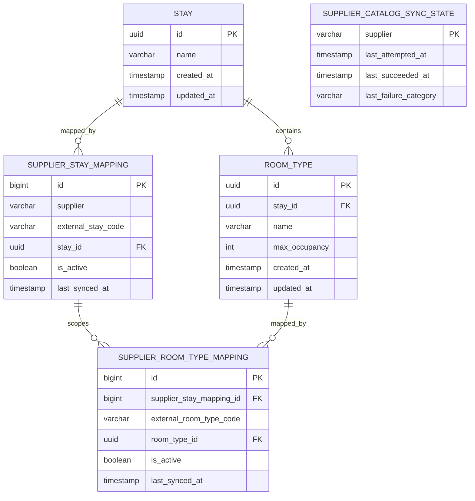

# Unified Domain Model

상태: Proposed - Gate 2 review

## 모델링 기준

외부 상품의 정적 정보와 동적 정보를 분리합니다.

- 정적 정보: 숙소, 객실 타입, 외부 코드 매핑
- 동적 정보: 요청 기간의 요금, 세금, 조식 조건, 일자별 재고

정적 정보와 매핑은 DB에 저장하고, 동적 정보는 검색할 때 Supplier에서 조회해 응답 범위에서만 사용합니다.

## 영속 모델



## 유일성 및 무결성

| 대상 | 제약조건 | 목적 |
|---|---|---|
| 숙소 매핑 | `unique(supplier, external_stay_code)` | 같은 외부 숙소의 내부 ID 유지 |
| 객실 매핑 | `unique(supplier_stay_mapping_id, external_room_type_code)` | 숙소 범위에서만 유일한 객실 코드 표현 |
| 객실 타입 | `room_type.stay_id not null` | 객실 타입의 내부 숙소 소속 보장 |
| 수용 인원 | `max_occupancy > 0` | 잘못된 정적 데이터 차단 |
| 동기화 상태 | `supplier` primary key | 정상 빈 목록과 최초 동기화 실패 구분 |

객실 타입 외부 키를 `(supplier, external stay code, external room type code)`로 해석하되 DB에서는 상위 숙소 매핑 FK를 사용해 동일한 유일성 범위를 표현합니다.

`supplier_catalog_sync_state`는 Supplier별 독립 상태로 관리하며 mapping과 직접 FK 관계를 맺지 않습니다. `last_succeeded_at`과 `last_failure_category`는 nullable입니다. 저장 시각은 UTC `timestamptz`로 저장합니다.

객실 매핑의 `room_type.stay_id`와 상위 숙소 매핑의 `stay_id`는 같아야 합니다. 동기화 서비스에서 이를 검증하고 통합 테스트로 보호합니다. 초기 버전은 단일 인스턴스에서 시작 시 한 번 동기화하는 구성이며, 다중 인스턴스의 동시 upsert는 별도 조정 없이 안전하다고 가정하지 않습니다.

## 식별자 정책

- 내부 숙소와 객실 타입 ID는 UUID를 사용합니다.
- UUID는 최초 매핑 생성 시 한 번 발급합니다.
- 동기화 시 외부 키로 기존 매핑을 먼저 조회합니다.
- 이름 또는 수용 인원이 바뀌어도 내부 ID는 변경하지 않습니다.
- 비활성 상품이 다시 등장하면 기존 매핑과 내부 ID를 재활성화합니다.
- 공급사가 다르면 동일한 이름의 숙소라도 기본적으로 별도 내부 ID를 사용합니다.

자동 중복 병합을 하지 않는 이유:

- 공급사 간 공통 식별자가 없습니다.
- 이름이 같아도 객실 조건, 조식, 가격 조건이 다를 수 있습니다.
- 잘못된 병합은 서로 다른 상품을 같은 상품으로 표시하는 더 큰 오류를 만듭니다.
- 향후 별도 matching 과정과 수동 검증을 갖춘 뒤 확장할 수 있습니다.

## 카탈로그 동기화 불변식

1. 외부 호출은 트랜잭션 밖에서 수행합니다.
2. Supplier별 응답의 필수 키와 중복 여부를 먼저 검증합니다.
3. 검증이 끝난 Supplier 응답만 하나의 쓰기 트랜잭션으로 반영합니다.
4. 외부 키가 존재하면 내부 ID를 유지하면서 정적 속성을 갱신합니다.
5. 외부 키가 없으면 새 내부 Entity와 매핑을 생성합니다.
6. 성공한 전체 목록에서 사라진 기존 매핑은 `is_active=false`로 변경합니다.
7. 매핑 반영과 같은 트랜잭션에서 `last_succeeded_at`을 갱신합니다. 빈 목록도 성공입니다.
8. 호출 또는 검증 실패 시 기존 매핑과 `last_succeeded_at`을 변경하지 않습니다.

부분만 반영해 catalog가 혼합된 상태가 되는 것을 피하기 위해 Supplier 하나의 목록과 성공 상태는 원자적으로 반영합니다. `last_attempted_at`과 실패 분류는 실패 관찰을 위해 별도 짧은 트랜잭션에서 갱신할 수 있습니다.

정상 반영 시 `last_failure_category`는 `null`로 초기화합니다. 실패 후 성공했는데 이전 실패가 현재 상태처럼 보이지 않도록 합니다.

## 검색 시 사용하는 모델

### SearchCondition

```text
checkIn: LocalDate
checkOut: LocalDate
adults: int
children: int
```

체크아웃 날짜는 숙박일에 포함하지 않습니다. 숙박일 집합은 `[checkIn, checkOut)`입니다.

### SupplierOffer

Supplier adapter가 외부 DTO를 다음 내부 모델로 변환합니다.

```text
supplier
externalStayCode
externalRoomTypeCode
stayName
roomTypeName
maxOccupancy
breakfastIncluded
inventoryByDate
price
```

검색 서비스는 외부 코드를 catalog mapping으로 확인한 뒤 내부 ID가 포함된 `StayOffer`를 만듭니다. 매핑되지 않은 응답은 고객에게 노출하지 않고 정규화 실패로 기록합니다.

### StayOffer

```text
stayId: UUID
stayName: String
roomTypeId: UUID
roomTypeName: String
maxOccupancy: int
availableRoomCount: int
supplier: Supplier
breakfastIncluded: boolean
price: PriceSummary
```

## 재고 정규화

요청 기간 전체에 대해 예약할 수 있는 객실 수를 반환합니다.

```text
availableRoomCount = min(remaining rooms for every requested night)
```

안전한 판매 가능성 판단을 위해 다음 규칙을 적용합니다.

- 요청한 모든 숙박일이 정확히 한 번씩 존재해야 합니다.
- 요청 범위 밖의 날짜는 재고와 일자별 금액 합산에 사용하지 않습니다.
- 숙박일이 누락되거나 중복되면 해당 offer만 제외하고 거절 건수를 기록합니다.
- 음수 재고는 잘못된 응답으로 처리합니다.
- 최솟값이 0이면 품절이며 통합 검색 결과에서 제외합니다.
- 요청 인원이 `maxOccupancy`를 초과한 offer는 방어적으로 제외합니다.

## 요금 정규화

공통 비교 기준은 요청 기간 전체의 세금 포함 결제 금액입니다.

```text
PriceSummary
- totalAmount: long
- currency: ISO 4217 code
- taxIncluded: boolean
- taxAmount: Long nullable
- nightlyBreakdown: List<NightlyPrice> nullable
```

### 보존하는 정보

- 총 결제 금액
- 통화
- 세금 포함 여부
- 조식 포함 여부
- Supplier가 제공하면 세액
- Supplier가 제공하면 일자별 금액

### 만들지 않는 정보

- 제공되지 않은 세액을 추정하지 않습니다.
- 전체 금액을 숙박일 수로 나눠 가상의 일자별 요금을 만들지 않습니다.
- 통화가 다를 때 임의 환율로 변환하지 않습니다.

금액은 통화의 최소 단위 정수이므로 `long`을 사용합니다. 통화가 다른 상품은 각각 원 통화로 노출하며 숫자만으로 직접 비교하지 않습니다.

`totalAmount`와 알려진 세액은 음수가 아니어야 합니다. `taxIncluded`는 정규화된 결과에서 항상 `true`입니다. 이를 확인할 수 없는 응답은 임의로 세금을 추정하지 않고 거절합니다. 합산은 overflow를 감지하는 연산을 사용하고 범위를 넘는 금액도 잘못된 offer로 처리합니다. `nightlyBreakdown.amount`는 해당 날짜의 세금 포함 금액이며 합계는 `totalAmount`와 일치해야 합니다.

## 모델링으로 인해 잃는 정보

| 선택 | 손실 또는 제약 | 보완 |
|---|---|---|
| 총 결제 금액을 공통 기준으로 사용 | 일자별 요금이 없는 Supplier는 nightly 비교 불가 | breakdown을 nullable로 유지 |
| 공급사별 상품을 별도로 노출 | 동일 숙소 결과가 여러 개일 수 있음 | source와 조건을 명확히 표시 |
| 실시간 데이터를 저장하지 않음 | 과거 검색 재현이 어려움 | 필요 시 원본 격리/검색 이력 확장 |
| 서로 다른 통화를 변환하지 않음 | 단일 가격순 정렬 불가 | 환율 정책 도입 전 원 통화 보존 |

## Gate 2 검토 항목

- catalog에서 사라진 상품은 물리 삭제하지 않고 비활성화합니다.
- Supplier가 보내지 않은 세금 및 일자별 가격을 추정하지 않습니다.
- 매핑되지 않은 availability 응답은 노출하지 않고 정규화 실패로 기록합니다.
- 누락되거나 중복된 날짜가 있는 offer는 판매 불가로 처리합니다.
- 정상적인 빈 catalog와 동기화 미완료는 별도 상태로 구분합니다.
