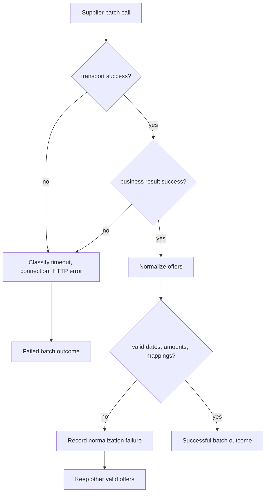

# Supplier Integration Resilience

상태: 필수 장애 격리·검색 정책 구현 완료

## 기본 원칙

외부 연동의 실패는 예외 상황이 아니라 정상적인 운영 조건으로 다룹니다. 검색의 목표는 가능한 결과를 최대한 반환하면서 불완전한 응답임을 숨기지 않는 것입니다.

## 호출 설정

| 설정 | 기본값 | 근거 |
|---|---:|---|
| connect timeout | 500ms | 검색 요청에서 연결 불가능한 endpoint를 빠르게 배제 |
| response timeout | 2s | 외부 응답을 기다리면서 전체 검색 지연이 과도해지는 것을 방지 |
| batch size | 50 | Supplier bulk 요청 제한 준수 |
| max concurrency | 4 | 수천 개 숙소에서도 무제한 동시 호출 방지 |

모든 값은 configuration property로 관리하며 테스트에서는 더 짧은 값으로 override합니다. 운영 지표가 쌓이기 전의 초기값이므로 고정된 정답으로 보지 않습니다.

response timeout은 전체 검색 요청의 2초 완료를 보장하지 않습니다. batch 수가 동시성 제한보다 크면 대기열이 생깁니다. 예를 들어 20개 batch를 concurrency 4로 처리하면 최대 5번의 실행 구간이 필요합니다. 전체 검색 deadline과 Supplier별 전역 bulkhead는 초기 구현의 보장 범위 밖입니다.

## WebClient 구성

- Supplier별 base URL과 API key를 분리합니다.
- Reactor Netty connection timeout과 response timeout을 명시합니다.
- 최초 요청 전 네트워크 런타임을 warmup합니다. Supplier HTTP 호출이나 응답 cache 생성은 아닙니다.
- 응답 전체 수신과 역직렬화가 끝나는 publisher에도 2초 deadline을 적용해 조금씩 데이터를 보내는 응답이 계속 연결을 점유하지 못하게 합니다.
- API key는 header filter에서 주입하고 로그에서 마스킹합니다.
- 응답 크기 제한을 설정해 비정상적으로 큰 본문으로부터 메모리를 보호합니다.
- 외부 HTTP 상태와 본문 result를 adapter 내부에서 공통 실패로 변환합니다.

## 실패 처리 흐름



알려진 외부 오류는 각 batch의 결과로 변환해 다른 batch를 보존합니다. 예상하지 못한 내부 결함까지 포괄적으로 잡아 외부 오류로 바꾸지 않습니다.

```text
SupplierBatchOutcome
- validOffers
- validOfferCountBeforeBusinessFiltering
- isValidatedEmptyBatch
- rejectedOfferCount
- failure nullable
```

호출이나 배치 본문 자체를 해석할 수 없으면 `failure`를 기록합니다. 본문을 해석할 수 있고 일부 offer만 잘못된 경우에는 유효한 offer를 유지하고 `rejectedOfferCount`만 증가시킵니다.

## 응답 결정표

2026-09-04 승인된 [POL-003 C안](search-response-policy.md)을 적용합니다. 정상 빈 catalog는 외부 batch 수에 넣지 않고 별도 관측으로 집계합니다.

| 유효한 관측 | 누락·오류 | API 결과 |
|---|---|---|
| 있음 | 없음 | 200, `partial=false` |
| 있음 | batch 실패, offer 거절 또는 미준비 catalog | 200, `partial=true` |
| 없음 | 외부 계약 위반 | 502, `NO_VALID_SUPPLIER_DATA` |
| 없음 | 외부 이용 불가 | 503, `ALL_SUPPLIERS_UNAVAILABLE` |
| 없음 | 내부 mapping 불일치 | 503, `CATALOG_MAPPING_UNAVAILABLE` |
| 없음 | 연동 요청·인증 설정 문제 | 500, `INTEGRATION_CONFIGURATION_ERROR` |
| 관계없음 | 예상하지 못한 내부 결함 | 500, `INTERNAL_ERROR` |

혼합 오류의 우선순위는 [정책 판정 순서](search-response-policy.md#5-최종-응답의-판정-순서)에 따릅니다.

성공 batch가 빈 목록을 반환한 것은 장애가 아닙니다.

위 결정표는 모든 Supplier의 catalog가 준비된 경우를 기준으로 합니다. 하나도 준비되지 않았으면 `CATALOG_NOT_READY`를 반환합니다. 일부만 준비되었다면 나머지 Supplier를 `unavailableCatalogSuppliers`로 알리고 `partial=true`로 응답합니다. 준비된 catalog가 모두 정상 빈 목록이면 외부 availability 호출 없이 HTTP 200과 빈 결과를 반환합니다.

## 재시도 정책

첫 구현에서는 자동 재시도를 사용하지 않습니다.

이유:

- 타임아웃과 부분 성공이라는 필수 동작을 먼저 명확히 검증할 수 있습니다.
- 검색 요청 중 재시도는 tail latency와 외부 부하를 함께 증가시킵니다.
- Supplier별 rate limit과 SLA 없이 일괄 재시도 횟수를 정하는 것은 근거가 약합니다.

추가한다면 다음 원칙을 적용합니다.

- 인증 및 입력 오류는 재시도하지 않습니다.
- rate limit은 `Retry-After`가 있을 때만 존중합니다.
- 연결 오류, 일부 5xx, 일시적 본문 오류만 최대 1회 재시도합니다.
- 짧은 exponential backoff와 jitter를 사용합니다.
- 전체 요청 시간 예산 안에서만 재시도합니다.

## Circuit Breaker

첫 구현에서는 설계만 남깁니다. 반복 실패 Supplier를 빠르게 차단하는 이점은 있지만, 작은 mock 데이터만으로 threshold를 정하면 설명보다 설정이 앞설 수 있습니다.

추후 Resilience4j를 적용한다면 Supplier와 operation 단위로 분리하고 다음을 지표 기반으로 조정합니다.

- sliding window size
- failure rate threshold
- slow call threshold
- open state wait duration
- half-open permitted calls

## 관찰 가능성

구현된 metric:

| 이름 | tags | 설명 |
|---|---|---|
| `supplier.availability.duration` | supplier, outcome | batch Timer: COUNT는 호출 수, TOTAL_TIME/MAX는 지연. TIMEOUT 태그로 타임아웃 집계 |
| `supplier.catalog.sync` | supplier, outcome | catalog 동기화 결과 |
| `supplier.catalog.sync.duration` | supplier, outcome | catalog 동기화 지연 |
| `supplier.catalog.state.failures` | supplier | 실패 상태 저장 오류 |
| `search.duration` | outcome | 정상·PARTIAL·원인별 오류 Timer, 정상 빈 결과는 SUCCESS |
| `search.observations` | kind | valid_offer(업무 필터 전), empty_batch, empty_catalog |
| `search.rejections` | kind | invalid_data, missing_mapping |

Supplier batch의 PARTIAL_DATA는 개별 거절 존재를 의미하며, 검색 최종 성공 여부는 `search.duration`을 함께 봅니다. 내부 결함으로 취소한 호출은 CANCELLED로 따로 집계합니다. `search.*`는 서비스에 진입한 유효 요청을 측정하며 입력 400은 기본 `http.server.requests`에서 확인합니다.

Correlation ID는 MVC 진입 시 검증하고 Reactor Context로 공급사 호출에 전달합니다. MDC를 비동기 스레드에서 그대로 읽는 방식에 의존하지 않습니다. 로그 패턴에 MDC와 key-value 필드를 출력합니다. 원문 예외 메시지는 출력하지 않고 내부 오류 타입을 기록합니다.

활성 mapping gauge, freshness alert와 주기 refresh는 확장 항목으로 남아 있습니다. catalog 성공 시각은 DB snapshot에 보존되며, 현재 지표만으로 실시간 최신성을 주장하지 않습니다.

외부 상품 코드, URL, 오류 메시지와 같은 high-cardinality 값은 metric tag에 넣지 않습니다.

로그 필드:

- `traceId`
- `supplier`
- `operation`
- `outcome`
- `durationMs`
- `failureCategory`
- `batchSize`

API key와 전체 원본 응답은 로그에 남기지 않습니다.

## Mock 시나리오

WireMock은 별도 포트에서 다음을 재현합니다.

- 정상 catalog 및 availability 응답
- HTTP 오류 응답
- HTTP 성공 상태와 본문 실패 조합
- 연결은 수락하지만 요청 deadline 동안 응답하지 않는 `no-response` 모드
- 응답 지연 모드: deadline 전후의 지연 시간을 따로 검증

`no-response`는 긴 고정 지연으로 재현할 수 있습니다. 예를 들어 batch deadline이 2초라면 10분 지연을 주고, 실제로 10분을 기다리지 않고 client가 2초 안팎에서 취소하는지 검증합니다. 단순 연결 거부와 무응답은 서로 다른 테스트입니다.

상태 전환용 control mapping은 WireMock scenario 기능으로 구성합니다. 실제 adapter URL과 mock control URL은 분리합니다.
